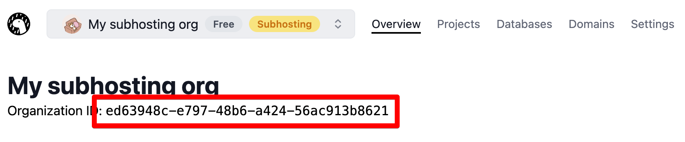

# Deno Deploy REST API

开发者可以通过使用 Deno Deploy REST API
来配置项目、域名、KV数据库等资源。该API最常用于实现
[Subhosting](/deploy/manual/subhosting)，这是 Deno Deploy
的一种用例，允许你在云中代表用户运行不受信任的代码。

[请参阅手册](/deploy/manual/subhosting) 以深入了解 Subhosting。

## 终端点和身份验证

Deno Deploy REST API v1 的基本URL如下。

```
https://api.deno.com/v1/
```

v1 API 使用
[HTTP Bearer Token](https://swagger.io/docs/specification/authentication/bearer-authentication/)
身份验证。你可以在[仪表板](https://dash.deno.com/account#access-tokens)中创建访问令牌以使用API。大多数API请求还需要组织ID，你可以在
Deno Deploy 仪表板中找到你组织的ID。



通过组织ID和访问令牌，你可以通过列出与你的组织关联的所有项目来测试API访问。以下是一个示例
Deno 脚本，你可以使用它来访问API。

```typescript
// 用你自己的替换这些值!
const organizationId = "a75a9caa-b8ac-47b3-a423-3f2077c58731";
const token = "ddo_u7mo08lBNHm8GMGLhtrEVfcgBsCuSp36dumX";

const res = await fetch(
  `https://api.deno.com/v1/organizations/${organizationId}/projects`,
  {
    method: "GET",
    headers: {
      Authorization: `Bearer ${token}`,
    },
  },
);

const response = await res.json();
console.log(response);
```

## OpenAPI 规范和工具

Deploy API 的 [OpenAPI 规范](https://www.openapis.org/) 可在此处找到：

```
https://api.deno.com/v1/openapi.json
```

该规范文档可与 [许多兼容OpenAPI的工具](https://openapi.tools/)
一起使用。除了此处维护的 REST API
文档外，你还可以在[此处](https://apidocs.deno.com/)找到自动生成的API文档（包括基于浏览器的测试工具）。
