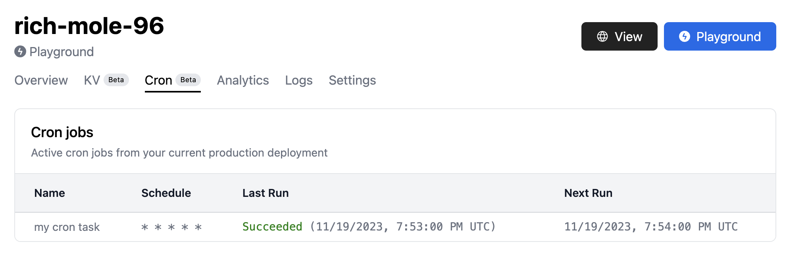

import Admonition from "./_admonition.mdx";

# 调度 Cron 任务

<Admonition />

[`Deno.cron`](https://deno.land/api?s=Deno.cron&unstable=) 接口使您能够使用
[cron 语法](https://en.wikipedia.org/wiki/Cron) 配置在可配置的时间表上执行
JavaScript 或 TypeScript 代码。在下面的示例中，我们配置了一个 JavaScript
代码块，它将每分钟执行一次。

```ts title="记录消息"
Deno.cron("Log a message", "* * * * *", () => {
  console.log("这将每分钟打印一次。");
});
```

`Deno.cron` 接受三个参数：

- 一个人类可读的 cron 任务名称
- 一个 [cron 时间表字符串](https://cronitor.io/guides/cron-jobs)，定义了 cron
  作业将运行的时间表
- 在给定时间表上执行的函数

如果您对 cron 语法不熟悉，可以参考
[crontab.guru](https://crontab.guru/)，这是一个基于浏览器的工具，提供了一个交互式界面来尝试不同的
cron 语法。还有一些第三方模块
[像这个](https://www.npmjs.com/package/cron-time-generator) 可以帮助您生成 cron
时间表字符串。

## 重试失败的运行

失败的 cron
调用将自动使用默认的重试策略重试。如果您想指定自定义重试策略，可以使用
`backoffSchedule`
属性指定一个数组，其中包含在再次重试函数调用之前等待的时间（以毫秒为单位）。在以下示例中，我们将尝试三次重试失败的回调 -
分别在一秒钟、五秒钟和十秒钟后。

```ts title="重试示例"
Deno.cron("Retry example", "* * * * *", () => {
  throw new Error("Deno.cron 将尝试重试三次，但无济于事！");
}, {
  backoffSchedule: [1000, 5000, 10000],
});
```

## 设计和限制

在使用 `Deno.cron` 时，请注意以下设计细节和限制。

### 任务必须在顶层模块范围内定义

[`Deno.cron`](https://deno.land/api?s=Deno.cron&unstable=)
接口旨在支持基于预定义时间表的 cron 任务的静态定义。所有 `Deno.cron`
任务必须在模块的顶层定义。任何嵌套的 `Deno.cron` 定义（例如在
[`Deno.serve`](https://deno.land/api?s=Deno.serve&unstable=)
处理程序内部）将导致错误或被忽略。

如果您需要在执行 Deno 程序期间动态调度任务，可以使用
[Deno Queues](./queue_overview) APIs。

### 时区

`Deno.cron` 的时间表使用 UTC 时区指定。这有助于避免观察夏令时的时区问题。

### 重叠执行

您的 cron
任务的下一个预定调用可能与前一个调用重叠。如果发生这种情况，`Deno.cron`
将跳过下一个预定的调用，以避免重叠执行。

## 在 Deno Deploy 上的使用

通过 [Deno Deploy](https://www.deno.com/deploy)，您可以在云中的 V8
隔离中运行后台任务。在这样做时，有一些需要注意的事项。

### 与 Deno CLI 的不同之处

与其他 Deno 运行时内置功能（如队列和 Deno KV）一样，`Deno.cron` 在 Deno Deploy
上的实现略有不同。

#### 默认情况下 cron 的工作方式

Deno 运行时中 `Deno.cron` 的实现将执行状态保存在内存中。如果运行使用 `Deno.cron`
的多个 Deno 程序，则每个程序都将有其自己独立的 cron 任务集。

#### Deno Deploy 上 cron 的工作方式

Deno Deploy 提供了一个面向高可用性和规模的 `Deno.cron` 服务器实现。Deno Deploy
在部署时会自动提取您的 `Deno.cron`
定义，并使用按需隔离进行调度。您的最新生产部署定义了计划执行的活动 cron
任务集。要添加、删除或修改 cron 任务，只需修改您的代码并创建新的生产部署。

Deno Deploy 保证您的 cron 任务每个计划的时间间隔至少执行一次。这通常意味着您的
cron
处理程序将每个计划的时间调用一次。在某些故障情况下，处理程序可能对同一计划的时间多次调用。

### Cron 仪表板

在制作包含 cron 任务的生产部署时，您可以在
[Deploy 仪表板](https://dash.deno.com/projects) 的项目 `Cron` 选项卡下查看所有
cron 任务的列表。



### 价格

`Deno.cron` 调用按照与入站 HTTP 请求相同的速率计费。了解更多关于价格的信息
[here](https://deno.com/deploy/pricing)。

### 部署特定的限制

- `Deno.cron` 仅适用于生产部署（不适用于预览部署）
- 您的 `Deno.cron` 处理程序的确切调用时间可能与计划时间相比提前一分钟

## Cron 配置示例

以下是一些常见的 cron 配置，供您参考。

```ts title="每分钟运行一次"
Deno.cron("Run once a minute", "* * * * *", () => {
  console.log("你好，cron！");
});
```

```ts title="每十五分钟运行一次"
Deno.cron("Run every fifteen minutes", "*/15 * * * *", () => {
  console.log("你好，cron！");
});
```

```ts title="每小时整点运行一次"
Deno.cron("Run once an hour, on the hour", "0 * * * *", () => {
  console.log("你好，cron！");
});
```

```ts title="每三小时运行一次"
Deno.cron("Run every three hours", "0 */3 * * *", () => {
  console.log("你好，cron！");
});
```

```ts title="每天凌晨 1 点运行一次"
Deno.cron("Run every day at 1am", "0 1 * * *", () => {
  console.log("你好，cron！");
});
```

```ts title="每周三午夜运行一次"
Deno.cron("Run every Wednesday at midnight", "0 0 * * WED", () => {
  console.log("你好，cron！");
});
```

```ts title="每月初午夜运行一次"
Deno.cron("Run on the first of the month at midnight", "0 0 1 * *", () => {
  console.log("你好，cron！");
});
```
